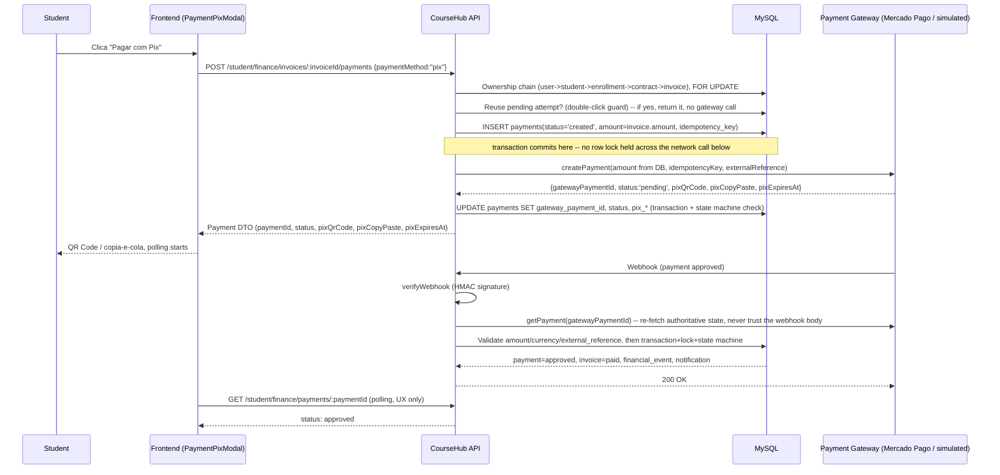

# Real Payment Gateway (Mercado Pago) + Financial Hardening

Status: implemented, pending migration application + full test run against
the dev database (see "Pending" below).
Branch: `feature/chat-institucional-etapa-14-hardening-observabilidade` (this
work landed on top of the existing notifications/chat branch; consider a
dedicated branch before merging to `main`).

## Objective

Evolve the existing financial module (`enrollment -> financial_contract ->
invoice -> payment`, `financial_events`, `payment_events`,
`simulatedGateway.js`) so a student can actually pay an invoice with a real
gateway (Mercado Pago, PIX first), instead of the module only supporting
admin-recorded manual payments. No parallel financial schema was created —
every new piece plugs into the tables and services that already existed.

## 1. Architecture

```text
services/paymentGateway/
  paymentGatewayContract.js   JSDoc contract + buildExternalReference/buildIdempotencyKey/formatDateTimeForMySQL
  paymentGatewayFactory.js    getPaymentGateway() / resolveGatewayByName(name) -- the ONLY place that branches on provider
  simulatedGateway.js         dev/test provider, same contract, in-memory state
  mercadoPagoGateway.js       real provider, wraps the official `mercadopago` npm SDK

services/financial/
  paymentStateMachine.js       payments.status transition rules (single source of truth)
  studentPaymentService.js     student-facing: createInvoicePayment, getInvoicePaymentByUser
  paymentProcessingService.js  shared engine: processGatewayPaymentUpdate (webhook + dev-simulate route both call this)
  paymentService.js            existing admin manual-payment registration (fixed source/gateway semantics)
  paymentRefundService.js      existing admin refund (now gateway-aware)

routes/
  studentFinanceRoutes.js      + POST /student/finance/invoices/:invoiceId/payments, GET /student/finance/payments/:paymentId
  paymentWebhookRoutes.js      POST /webhooks/payments/mercado-pago (public) + POST /webhooks/payments/simulated/:paymentId/approve (dev-only)
```

No `orders`/`order_items` tables were introduced. `invoices` already represents
the obligation; `payments` already represents an attempt against it. That
model was kept exactly as-is.

## 2. Creation flow



The frontend `usePaymentPolling` hook polls this GET every 4s (capped at ~5
minutes) purely so the modal updates without a manual refresh — **the webhook
is the actual source of truth**, not the polling response.

## 3. Source of truth for money

The route only accepts `{ paymentMethod }` in the body. `invoiceId` comes from
the URL. `studentPaymentService.createInvoicePayment` reads `invoices.amount`
directly from the database inside a `FOR UPDATE` transaction and that is the
only value ever sent to the gateway — any other property a client sends
(`amount`, `status`, `gateway`, `studentId`...) is never read (the function's
own parameter destructuring only pulls `userId`, `invoiceId`, `paymentMethod`
out of its arguments), so mass-assignment has no effect. Covered by the "extra
client-supplied fields are never read" test.

## 4. Authorization / IDOR

`lockOwnedOpenInvoice` joins `invoices -> financial_contracts -> enrollments`
with `enrollments.student_id = ?`, where the student id is resolved from
`req.auth.userId` (never from the request body). An invoice that doesn't
belong to the caller produces zero rows — indistinguishable from "doesn't
exist" — a 404, matching the same pattern the chat module already uses
(`assertParticipant`). Same ownership chain repeated for
`GET /student/finance/payments/:paymentId`.

## 5. Idempotency / concurrency

Two independent mechanisms, for two independent failure modes:

- **Duplicate client request** (double-click, two tabs, retried POST):
  `createInvoicePayment` looks for an existing `pending` PIX attempt for the
  invoice (not expired, created under the currently active gateway) and
  returns it unchanged instead of creating a new one — no second gateway call
  happens at all.
- **Gateway-side retry safety**: every attempt still gets its own
  `idempotencyKey` (`coursehub-payment-{paymentId}`), sent as Mercado Pago's
  own `X-Idempotency-Key` (via the SDK's `requestOptions.idempotencyKey`) —
  the pattern suggested in the original brief. This protects the one
  `POST /v1/payments` call itself from ever creating two charges at the
  provider even if something above it were retried later.

A row lock is never held across the outbound HTTP call to the gateway in
`studentPaymentService` (creation is student-facing, potentially higher
volume): the "reserve a row" transaction commits, the gateway call happens
unlocked, then a second short transaction applies the result under a fresh
lock. `paymentRefundService`, by contrast, *does* hold the lock across its
(admin-only, low-volume) refund call — documented inline as a deliberate
simplicity trade-off, not an oversight.

Two invoices are explicitly allowed to end up with several `payments` rows
(expired PIX, cancelled PIX, then an approved one) — what's protected is two
of them ever both reaching `approved` for the same invoice (see
`applyApproval`'s `duplicateInvoicePayment` branch below).

## 6. Webhook

`POST /api/webhooks/payments/mercado-pago` — public, no JWT (it's called by
Mercado Pago, not a logged-in user).

**Signature verification** uses the official SDK's own
`WebhookSignatureValidator.validate({xSignature, xRequestId, dataId, secret,
toleranceSeconds: 300})` (HMAC-SHA256 over
`id:{data.id};request-id:{x-request-id};ts:{ts};`, constant-time compared) —
confirmed by reading the installed SDK's real implementation
(`node_modules/mercadopago/dist/utils/webhook/index.js`), not assumed from
memory or from documentation-summary tooling.

**Raw body**: not needed. The signature is computed over headers and the
`data.id` query parameter, never the request body bytes — verified the same
way. `express.json()` stays exactly where it already was in `server.js`; no
raw-body special-casing was introduced for this route.

**Never trusts the notification body.** `parseWebhook` extracts only
`gatewayPaymentId`/`gatewayEventId` — never a status or amount from the
payload. `processGatewayPaymentUpdate` always re-fetches the payment via
`gateway.getPayment(gatewayPaymentId)` and validates `amount`, `currency`,
and `external_reference` against the local row before applying anything.

**Idempotency** uses the existing `payment_events.gateway_event_id` UNIQUE
constraint as the dedup gate: the notification's own `id` field is stable
across Mercado Pago's retries of the same delivery and distinct across
genuinely different events. A duplicate delivery's `INSERT` hits
`ER_DUP_ENTRY` and the handler returns before doing any business work.
Independently, the state machine (`canTransition`) is a second, structural
backstop: re-applying `approved` a second time is a no-op even without the
event-id check, so idempotency doesn't rely on a single mechanism.

**Out-of-order delivery** (a `pending` notification arriving after
`approved` was already applied) is detected via `canTransition` returning
`false` for `approved -> pending` and is logged + ignored, never applied,
never surfaced to Mercado Pago as an error (so it isn't endlessly retried).

**Unknown `gateway_payment_id`** (no local `payments` row matches): logged
via `console.warn` and acknowledged with 200, no database write. Explicitly
*not* a `payment_events` row — that table's `payment_id` is `NOT NULL` and
FK-enforced, and weakening that constraint for every other (matched,
security-relevant) row wasn't judged worth it for what should be rare
operational noise (a stale/misconfigured webhook URL, a test-mode
notification). This is the one place a "minimal migration" was considered and
deliberately not done — logging was judged sufficient.

**Response codes**: `200` for every outcome the handler has already made a
final decision about (applied, duplicate, stale, unknown, validation
mismatch, malformed/ignored non-payment notification) — nothing about those
should make Mercado Pago retry. `401` only for a failed signature. `500` only
for a genuine unexpected failure (DB error surviving the deadlock retry),
which *should* make Mercado Pago retry the delivery later.

**No rate limiter** on this route on purpose — a limiter tuned for a human
clicking "pay" would also throttle Mercado Pago's own retry-until-200
delivery behavior.

## 7. Dev-only webhook simulation

The simulated gateway has no real HTTP transport, so
`POST /api/webhooks/payments/simulated/:paymentId/approve` plays that role in
development: it requires an authenticated user, is hard-blocked with a 404
when `NODE_ENV=production` or `PAYMENT_GATEWAY!=='simulated'`, and — this is
the important part — it does **not** set `payments.status` directly. It flips
the simulated gateway's own in-memory record to `approved`, then calls the
exact same `processGatewayPaymentUpdate` engine a real webhook uses. It is
not a "set any payment to any status" backdoor (section 78 of the original
brief): it can only ever move a *simulated* payment through the same
validated pipeline everything else goes through.

## 8. State machine

`payments.status`: `created -> pending -> approved -> refunded|chargeback`,
with `rejected`/`cancelled` reachable from `created`/`pending`. See
`paymentStateMachine.js` for the exact table. Every write to
`payments.status` in the codebase now goes through
`assertValidTransition`/`canTransition` first — a transition not in that
table is rejected (409) rather than silently applied.

Mercado Pago's own statuses (`approved`, `rejected`, `cancelled`, `refunded`,
`charged_back`, `pending`, `in_process`, `authorized`, `in_mediation`) are
normalized to CourseHub's five/six-value domain by exactly one function,
`mercadoPagoGateway.js#normalizeStatus` — nothing else in the codebase reads
a Mercado Pago status string.

## 9. payment_events vs financial_events

Kept exactly as the existing schema already separates them:

- `payment_events` — technical/transactional: every status transition a
  payment goes through, tagged with `source` (`system` for the creation
  response, `gateway_webhook` for a real webhook, `simulated_gateway` for the
  dev route, `admin` for a manual refund/registration) and, when available,
  `gateway_event_id` for dedup.
- `financial_events` — business audit: `invoice_paid`,
  `payment_refunded`... (already existed for admin actions; the gateway path
  now writes the same event types with `source: 'gateway'` instead of
  `'admin'`).

## 10. Duplicate payments on the same invoice

If a student manages to actually pay two different attempts on the same
invoice (e.g. pays an old PIX code after a new one was already generated),
the second `approved` webhook is **not** dropped — the payment row is still
marked `approved` (the money is real and must not be lost from the audit
trail), but the invoice is not touched a second time, and a
`payment_approved_after_invoice_already_paid` `financial_event` is written
flagging it for manual reconciliation. There's no admin UI for this yet —
noted under "Pending" below.

## 11. Refund

`POST /api/admin/financial/payments/:paymentId/refund` (existing endpoint,
contract preserved). `paymentRefundService` now branches on `payment.source`:

- `admin_manual` → local-only, no gateway ever called (there is nothing at a
  provider to refund).
- `gateway` (a `simulated` or `mercado_pago` payment) → resolves the adapter
  via `resolveGatewayByName(payment.gateway)` and calls `refundPayment()`.
  Only marks the local payment `refunded` if the provider actually reports
  `status: "refunded"` — a provider error/rejection leaves the payment
  `approved` and the request fails with 502.

A `payment_events` row (`payment_refunded`) is now written on refund, which
the pre-existing implementation did not do.

## 12. Chargeback

No admin UI. `paymentProcessingService.applyChargeback` handles a
`charged_back` status arriving via webhook: `payments.status = 'chargeback'`,
`invoices.status = 'refunded'` (closest existing semantic — money is no
longer with the school), `financial_event`, contract recalculated. Neither
the payment nor the invoice row is ever deleted.

## 13. Manual payment source/gateway fix

`registerManualPayment` previously inserted `gateway: 'simulated'` and never
set `source` (defaulting to `'gateway'`) — indistinguishable from a real
gateway-processed payment. Fixed to `gateway: 'manual'` (a sentinel meaning
"no provider involved", distinct from the two real provider names) and
`source: 'admin_manual'`. **Existing rows were not retroactively updated** —
there is no reliable way to tell, after the fact, which historical
`gateway='simulated'` rows were genuinely processed by the simulated gateway
versus manually mis-recorded; a blind `UPDATE` based on a guess would be
worse than leaving the (documented) inconsistency in place. Only new writes
are affected.

## 14. Security review (section 89 of the brief)

Attacks attempted against the design, and the specific mechanism that stops
each one:

| Attempt | Stopped by |
|---|---|
| Change `invoiceId` in the URL to another student's invoice | `lockOwnedOpenInvoice`'s `en.student_id = ?` join → 404 |
| Send `{ amount: 1 }` in the body | Never read — amount comes from `invoices.amount` |
| Send `{ status: "approved" }` in the body | Never read — status only ever comes from `gateway.createPayment`'s real response |
| Repeat the create `POST` (double-click / retry) | Existing-pending-attempt reuse → same row returned, no new gateway call |
| Forge a webhook body with `status: approved` | `getPayment()` re-fetch is the only source of truth used, not the body |
| Replay a captured, otherwise-valid webhook | `toleranceSeconds: 300` on signature validation + `payment_events` dedup |
| Send a webhook with someone else's `data.id` but wrong amount | `amount`/`currency`/`external_reference` cross-check → `validation_mismatch`, not applied |
| Manually flip a payment's status via a hypothetical `PATCH` | No such endpoint exists — status only changes through the state machine inside `applyApproval`/`applyTerminalNonApproval`/`applyChargeback` |
| Call the refund endpoint twice quickly | Row lock held for the duration of the refund + `status !== 'approved'` guard → second call 409s |
| Hit `/webhooks/payments/simulated/:id/approve` in production | Hard 404 (`NODE_ENV`/`PAYMENT_GATEWAY` check) |
| Read `MERCADO_PAGO_ACCESS_TOKEN` via the health endpoint | `getPaymentGatewayHealth()` only ever returns a boolean + the provider name |

**CSRF**: not re-architected. The existing cookie config
(`httpOnly: true, sameSite: "lax", secure: NODE_ENV==="production"`, see
`backend/utils/cookies.js`) already mitigates cross-site POSTs for every
other mutable financial endpoint (`manual-payment`, `refund`, due-date
changes...); the new payment-creation endpoint was kept consistent with that
existing, already-accepted mitigation rather than introducing a
payment-specific CSRF token mechanism.

**PCI DSS**: only PIX is implemented. CourseHub's backend never receives a
card number, CVV, or expiry date — there is no code path that could. Card
support, if added later, must use Mercado Pago's own tokenization
component/Brick in the browser so raw card data never reaches this backend
at all (see `.env.example`'s note on `MERCADO_PAGO_PUBLIC_KEY`).

## 15. Environment variables

See `backend/.env.example` for the full, commented list. Summary:

| Variable | Required when | Notes |
|---|---|---|
| `PAYMENT_GATEWAY` | always | `simulated` (dev/test/CI only) or `mercado_pago` |
| `MERCADO_PAGO_ACCESS_TOKEN` | `PAYMENT_GATEWAY=mercado_pago` | backend secret, never logged, never sent to the frontend |
| `MERCADO_PAGO_WEBHOOK_SECRET` | `PAYMENT_GATEWAY=mercado_pago` | used only by `WebhookSignatureValidator` |
| `MERCADO_PAGO_PUBLIC_KEY` | not yet (card support only) | safe to expose to the frontend if/when used |
| `MERCADO_PAGO_WEBHOOK_URL` | recommended in production | base URL used to build `notification_url` |

`server.js` refuses to boot if `NODE_ENV=production` and `PAYMENT_GATEWAY=simulated`
(pre-existing check, preserved), and now also refuses to boot if
`PAYMENT_GATEWAY=mercado_pago` without both Mercado Pago variables set.

## 16. Migration

`database/migrations/20260812_001_add_payment_gateway_fields.sql` (+ paired
rollback in `database/rollback/`). Adds to `payments`: `idempotency_key`
(UNIQUE), `currency`, `external_reference` (indexed), `gateway_status`,
`gateway_status_detail`, `failure_code`, `last_synced_at`. No existing column
renamed/retyped/dropped. `payment_events`/`financial_events` needed no schema
change — their existing shape (including `payment_events`'
`UNIQUE(gateway_event_id)`) was already sufficient.

**This migration has not yet been applied to the shared dev database** — the
app's own `DB_USER` (least-privilege, no `ALTER`) correctly cannot run it;
elevated credentials are needed, same as previous migrations on this branch.

## 17. Testing

`backend/test/financial/paymentGateway.test.js`, `node --test`, real dev DB,
fixture: student 60 / course 5 / pricing plan 5 (disjoint from the other two
financial fixtures already used by `financialAndCalendar.test.js` and
`scheduledReminders.test.js`). Mocks the gateway by monkey-patching exported
functions on the already-required `simulatedGateway`/`mercadoPagoGateway`
modules for the duration of a single test (no Jest/Sinon dependency added —
consistent with the rest of the suite's "no test framework beyond
`node:test`" convention). No test ever calls the real Mercado Pago API.

Covers: ownership/IDOR, amount-from-DB, invoice-state guards (paid/cancelled/
refunded), double-click reuse, approval + notification + financial_event,
10x-repeated-webhook idempotency, `gateway_event_id` dedup, unknown-payment
webhook, out-of-order (stale `pending` after `approved`), amount-mismatch
rejection, two concurrent approvals (lock), webhook signature accept/reject
(including a direct comparison against the SDK's own validator), simulated
refund, manual refund (never calls a gateway), duplicate refund rejection,
and a mocked real-gateway refund success/failure pair.

**As of this writing, only the 6 tests that don't touch the new `payments`
columns pass** (`IDOR`, `cancelled`, `refunded`, `unknown_payment`, both
webhook-signature tests) — every other test fails with
`Unknown column 'currency'`, which is the pending migration (§16), not a
logic defect; each failure was individually confirmed to be exactly that one
error. Re-run after applying the migration.

## 18. Sandbox / how to test PIX manually

1. Get sandbox (`TEST-...`) credentials from "Suas integrações" in the
   Mercado Pago developer panel.
2. Set `PAYMENT_GATEWAY=mercado_pago`, `MERCADO_PAGO_ACCESS_TOKEN`,
   `MERCADO_PAGO_WEBHOOK_SECRET` in `backend/.env` (sandbox values only).
3. Expose the backend publicly (e.g. a tunnel) and set
   `MERCADO_PAGO_WEBHOOK_URL` + the same URL in the Mercado Pago webhook
   config panel, event `payment`.
4. As a student, click "Pagar com Pix" on an open invoice; the sandbox QR
   code/copy-paste is real and can be approved from the Mercado Pago test
   tools.

For local development without any of the above, leave
`PAYMENT_GATEWAY=simulated` (the default) — the QR code is a placeholder
marker, and approval is done via the dev-only route (§7) instead of a real
webhook.

## 19. Troubleshooting

- **"Não foi possível criar o pagamento" (502)** — the gateway call itself
  failed (timeout, invalid credentials, provider error). The payment row is
  marked `rejected` with `failure_code='gateway_create_failed'`; check the
  sanitized server log line for the underlying message.
- **Webhook returns 401** — signature mismatch. Confirm
  `MERCADO_PAGO_WEBHOOK_SECRET` matches the one shown in the Mercado Pago
  panel for this exact application/webhook configuration.
- **Invoice never flips to paid despite the student saying they paid** —
  check `payments.status` for that invoice's latest attempt first; if it's
  still `pending`, the webhook likely never arrived (check
  `MERCADO_PAGO_WEBHOOK_URL` is publicly reachable) — `GET /admin/system-health`
  now also reports whether the gateway looks configured.

## 20. Pending / manual follow-ups

- [ ] Apply `20260812_001_add_payment_gateway_fields.sql` to the dev database
      (needs elevated DB credentials) and re-run `npm test`.
- [ ] Card payments (out of scope for this round — PIX only, per the brief's
      own MVP priority).
- [ ] Admin-facing view for `payment_approved_after_invoice_already_paid`
      financial events (currently only visible via the contract's event
      history / direct DB query).
- [ ] No notification is sent on a rejected/expired PIX attempt yet (only on
      approval/refund, reusing the existing notification types) — could be a
      follow-up `financial.payment.failed` type if wanted.
